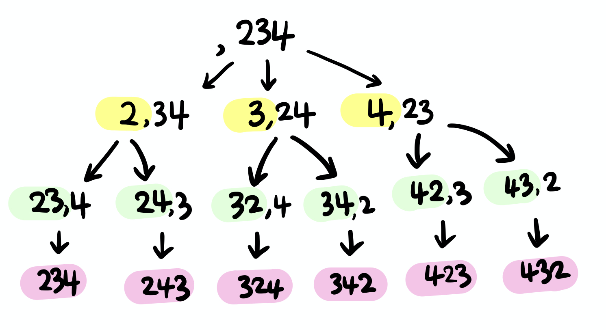

# 소수 찾기

> [프로그래머스 코딩테스트 연습 > 완전탐색 > 소수 찾기](https://programmers.co.kr/learn/courses/30/lessons/42839)
> 출처: 프로그래머스 코딩 테스트 연습, https://programmers.co.kr/learn/challenges

- Level2
- 완전탐색 (출제 빈도: 높음, 평균 점수: 낮음)

## 해결 과정

1. 주어진 numbers 로 만들 수 있는 모든 순열을 찾고, 중복되지 않도록 hashSet에 저장한다.
   
2. 소수인지를 검사해서 반환한다.

## 코드 1

```kotlin
fun solution(numbers: String): Int {
    val set = hashSetOf<Int>()
    permutation("", numbers, set)
    return set.filter { isPrime(it.toInt()) }.map { 1 }.sum()
}

fun permutation(result: String, numbers: String, set: HashSet<Int> ) {
    if (result.isNotEmpty()) {
        set.add(result.toInt())
    }
    for (i in 0 until numbers.length) {
        permutation(
            result + numbers[i],
            numbers.substring(0, i) + numbers.substring(i + 1),
            set)
    }
}

fun isPrime(n: Int) : Boolean {
    if(n<2) return false
    for(i in 2 until n) {
        if(n%i==0) return false
    }
    return true
}
```

```swift
func solution(_ nums:[Int]) -> Int {
    var number = nums.first ?? 0
    var resultArray: [Int] = []
    var visitedArray = Array.init(repeating: false, count: nums.count)
    
    func findPrimeNum(num: Int) -> Bool {
        let intNum = num
        var isPrime = true
        
        if intNum == 1 {
            return isPrime
        } else {
            for i in 2..<Int(sqrt(Double(intNum)) + 1) {
                if intNum % i == 0 {
                    isPrime = false
                    break
                }
            }
        }
        return isPrime
    }
    
    func dfs(_ depth: Int,_ num: Int,_ count: Int) {
    }

    for i in 1..<nums.count {
        dfs(1, nums[i], i)
    }
    
    return resultArray.count
```

## 배운 점

- 순열 찾는 전형적인 코드에 대해서 배울 수 있었다.
- 참고: [10974](https://www.acmicpc.net/problem/10974)
